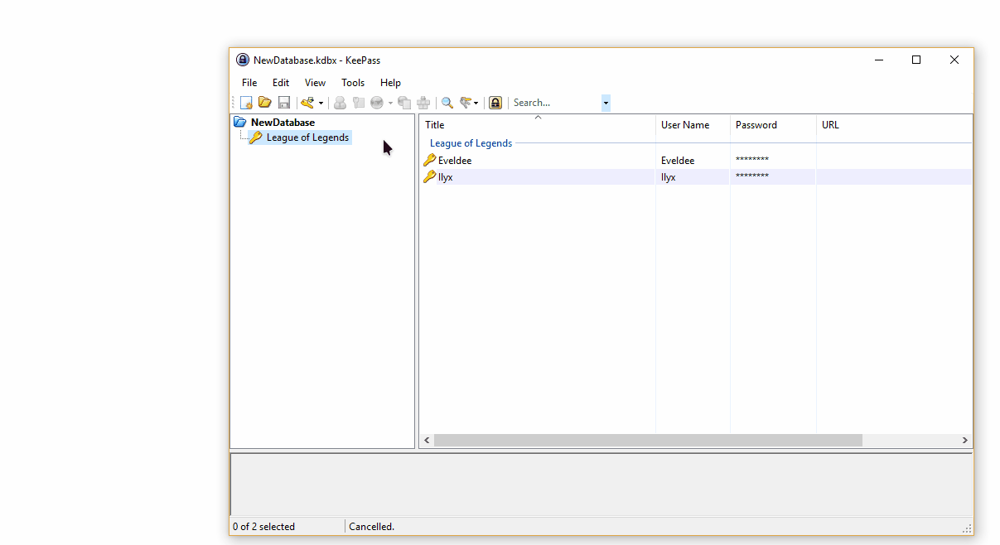

# KeePass-ExeIconPicker
[](https://github.com/eveldee0680/KeePass-ExeIconPicker/releases/latest) [](https://github.com/eveldee0680/KeePass-ExeIconPicker/blob/master/LICENSE)

ExeIconPicker plugin for KeePass 2.x is a plugin that let you grab an icon from a Windows executable file (.exe), a library (.dll) or an icon file (.ico) and use it as an entry or group icon.



# Documentation

- [Prerequisites](#prerequisites)
- [Installation](#installation)
- [Build](#build)
- [Contributing](#contributing)
- [Copyright and license](#copyright-and-license)

## Prerequisites

- KeePass 2.20 or newer
- Windows 7 or newer
- .Net Framework 3.5

## Installation

### Manual installation

- [Download](https://github.com/eveldee0680/KeePass-ExeIconPicker/releases) the plugin in .plgx format.
- Copy the file in your KeePass plugins directory (C:\Program Files (x86)\KeePass\Plugins).
- Restart *KeePass* if it was already running.


### Chocolatey 📦 
Or you can [use Chocolatey to install](https://community.chocolatey.org/packages/keepass-exe-icon-picker#install) it in a more automated manner:

```
choco install keepass-exe-icon-picker
```

To [upgrade KeePass Plugin Exe Icon Picker](https://community.chocolatey.org/packages/keepass-exe-icon-picker#upgrade) to the [latest release version](https://community.chocolatey.org/packages/keepass-exe-icon-picker#versionhistory) for enjoying the newest features, run the following command from the command line or from PowerShell:

```
choco upgrade keepass-exe-icon-picker
```

## Build

In order to build the plugin yourself, you will need to modify KeePassDir in the build.cmd file accorded to your *KeePass* installation folder.

Then you just need to run build.cmd and launch *KeePass*.

## Contributing

If you want to help the project, open a [new issue](https://github.com/eveldee0680/KeePass-ExeIconPicker/issues) or create a [new pull request](https://github.com/eveldee0680/KeePass-ExeIconPicker/pulls).

## Copyright and license

*ExeIconPicker* is licensed under the [Mit License](LICENSE).

*IconExtractor* library is under the [BSD License](https://opensource.org/licenses/bsd-license.php) and owned by [Tsuda Kageyu](https://www.codeproject.com/script/Membership/View.aspx?mid=5207992), you can get it [here](https://www.codeproject.com/Articles/26824/Extract-icons-from-EXE-or-DLL-files).

Also, some parts of my plugin are inspired by the great plugin [_Yet Another Favicon Downloader_](https://github.com/navossoc/KeePass-Yet-Another-Favicon-Downloader), so thanks to the author.
